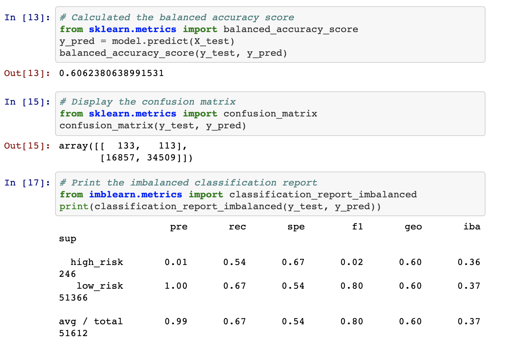
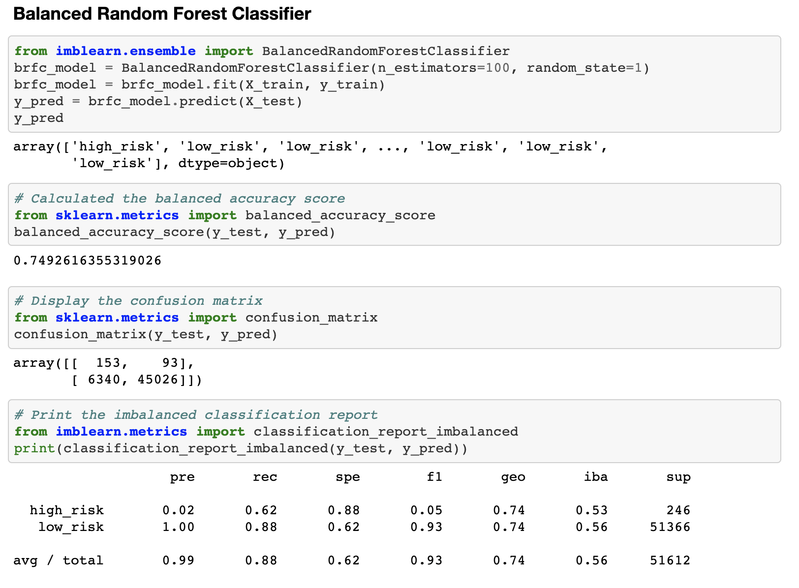
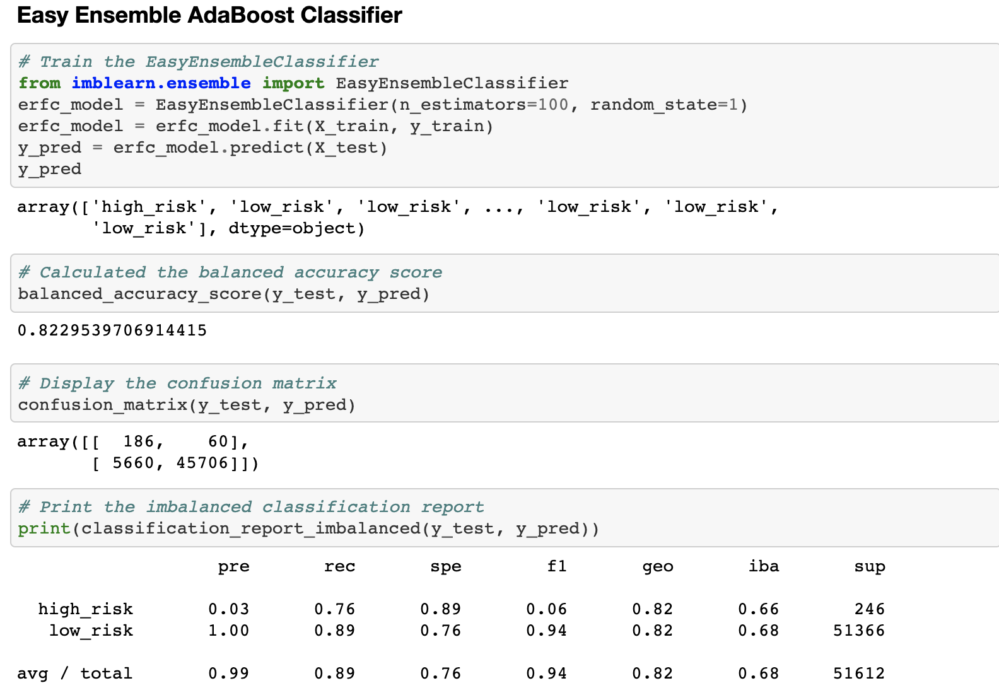
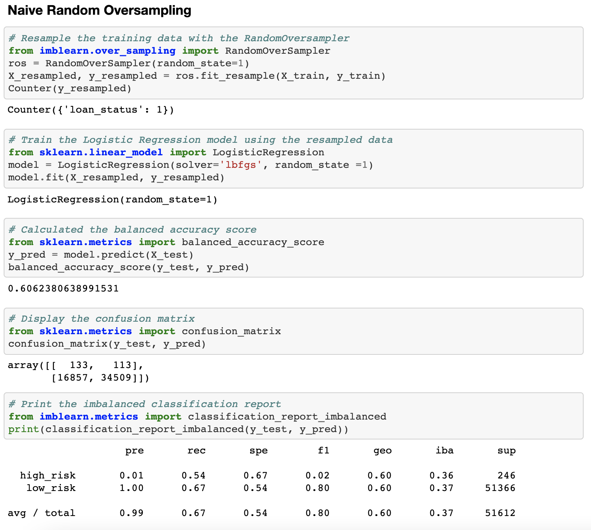
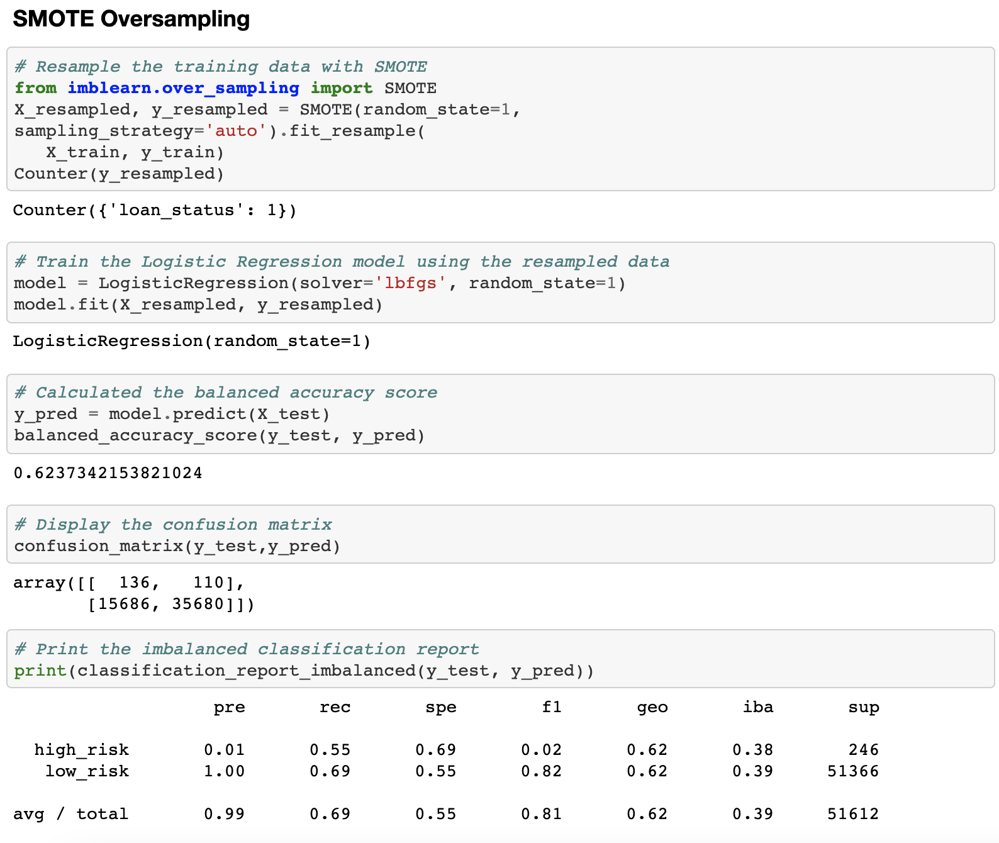
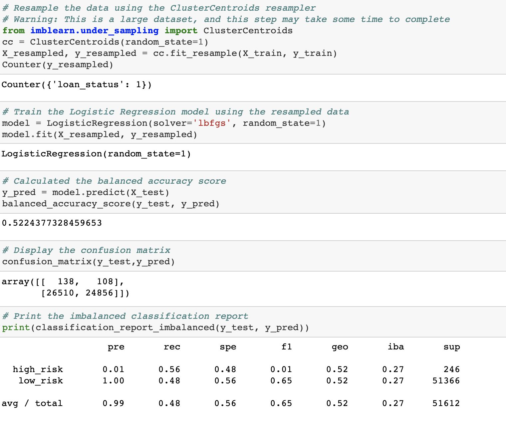

# Credit Risk Analysis

## Overview of the loan prediction risk analysis:

The purpose of this credit risk analysis project was to evaluate the performance of different models to predict credit risk. This was to be primarily achieved using mahcine learning and resampling. 

## Results:

Below were the results for our six machine learning models. 

## Naive Sampling

## Balanced Random Forest Classifier Sampling

## Easy Ensemble Sampling

## Naive Random Oversampling

## SMOTE Oversampling

## Undersampling

## Summary: 
Overall, although the testing seemed somewhat accurate, I do not recommend for it to be used as a primary tool because both undersampling and resampling did not contribute to an overall big change in our analysis logistic regression model.
